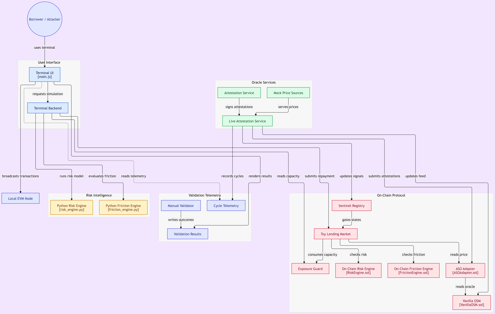

# ORIGIN — Economic Risk & Oracle Infrastructure
### Hierarchical Economic Exposure Guard (EEG) • Attested Staleness Oracle (ASO) • Sentinel Risk Engine

> **Publication-Grade DeFi Security Layer: Mathematical Velocity Bounding, Multi-Tier Token Buckets, EIP-712 Quorum Attestations, and Real-Time Economic Insolvency Protection.**

---

##  Architectural Workflow Overview



```text
┌────────────────────────────────────────────────────────────────────────────────────────┐
│                                 ORIGIN ARCHITECTURE                                    │
│                                                                                        │
│   [ Price Sources ] ──► [ Backend Risk Engine ] ──► [ EIP-712 Attestation Service ]    │
│    (Pyth, Binance,       (Median, Spread Bps,        (Typed Digest, ECDSA Signature)   │
│     Coinbase, Uniswap)    Volatility, Drift)                         │                 │
│                                                                      ▼                 │
│   [ Borrower / User ] ────────────────────────────────────► [ BorrowGateway.sol ]      │
│                                                                      │                 │
│   ┌──────────────────────────────────────────────────────────────────┴─────────────┐   │
│   │ ATOMIC PIPELINE (Single EVM Transaction):                                      │   │
│   │  1. ASOAdapter.sol           ── Verify EIP-712 Signature, Quorum & Spread      │   │
│   │  2. SentinelRegistry.sol     ── Assert Oracle State is HEALTHY                 │   │
│   │  3. ToyLendingMarket (EEG)   ── Consume Market-Level Capacity Bucket           │   │
│   │  4. RiskGroupExposureGuard   ── Consume Risk-Group Bucket (Correlated Assets)  │   │
│   │  5. GlobalExposureGuard      ── Consume Protocol-Wide Global Capacity Bucket   │   │
│   │  6. Debt Accounting          ── Originate Loan / Transfer Underlying Credit    │   │
│   └──────────────────────────────────────────────────────────────────┬─────────────┘   │
│                                                                      ▼                 │
│   [ Collateral Custody ] ◄──────────────────────────────── [ Credit Originated ]      │
└────────────────────────────────────────────────────────────────────────────────────────┘
```

---

## The Core Thesis

Oracle manipulation attacks (e.g., Mango Markets, Inverse Finance, Platypus, Venus, Euler) become catastrophic when a manipulated or distorted collateral price can **instantly extract 100% of available market liquidity within a single block**.

Rather than attempting to solve the undecidable problem of verifying whether an off-chain oracle is universally "honest" under extreme adversarial manipulation or private mempool collusion, **ORIGIN EEG** enforces a mathematical debt-velocity invariant directly at the EVM state transition layer:

$$\Delta \text{Debt}_{\text{new}} \le \text{Capacity}_0 + R_{\text{max}} \times \Delta t$$

**Core Insight:** By decoupling **instantaneous burst capacity** ($\text{Capacity}_0$) from **continuous throughput capacity** ($R_{\text{max}} \times \Delta t$), ORIGIN limits exploit profitability below the net cost of market manipulation, while providing $100\%$ seamless, frictionless execution for legitimate borrowers.

---

## Hierarchical Multi-Bucket Formal Formulation & Theorems

ORIGIN implements a **3-Tier Hierarchical Economic Exposure Guard** to prevent cross-market contagion, correlation cascading, and aggregate protocol liquidation drains.

```text
                 ┌──────────────────────────────────────┐
                 │       GLOBAL EXPOSURE GUARD          │
                 │   Capacity: $500,000 | Refill: $500/s│
                 └──────────────────┬───────────────────┘
                                    │
           ┌────────────────────────┴────────────────────────┐
           ▼                                                 ▼
┌──────────────────────────────────────┐  ┌──────────────────────────────────────┐
│       RISK GROUP: LSDs & LSTs        │  │      RISK GROUP: VOLATILE ALTS       │
│   Capacity: $200,000 | Refill: $200/s│  │   Capacity: $100,000 | Refill: $100/s│
└──────────────────┬───────────────────┘  └──────────────────┬───────────────────┘
                   │                                         │
        ┌──────────┴──────────┐                              ▼
        ▼                     ▼                   ┌─────────────────────┐
┌───────────────┐     ┌───────────────┐           │   MEME / PERP POOL  │
│  wstETH Pool  │     │  rETH Pool    │           │ Capacity: $30,000   │
│Cap: $100,000  │     │Cap: $100,000  │           │ Refill: $25/s       │
└───────────────┘     └───────────────┘           └─────────────────────┘
```

### 1. Mathematical Definitions

Let $\mathcal{M} = \{1, 2, \dots, M\}$ denote the set of all active lending markets in the protocol.  
Let $\mathcal{G} = \{G_1, G_2, \dots, G_K\}$ be a partition of $\mathcal{M}$ into disjoint risk groups sharing common collateral risk parameters or oracle dependencies, such that:

$$\bigcup_{k=1}^K G_k = \mathcal{M}, \quad G_j \cap G_k = \emptyset \quad (\forall j \ne k)$$

For any bucket $i \in \mathcal{M} \cup \mathcal{G} \cup \{\text{global}\}$, the bucket parameters are:
- $C_{\max, i} \in \mathbb{R}^+$: Maximum burst capacity allowance.
- $R_i \in \mathbb{R}^+$: Continuous linear replenishment rate per second.
- $t_{\text{last}, i} \in \mathbb{N}$: EVM timestamp of the most recent state transition.
- $C_i(t) \in [0, C_{\max, i}]$: Instantly available capacity at block timestamp $t$.

### 2. Continuous Replenishment Integral

Between discrete state interactions at block timestamps $t_{\text{last}}$ and $t$ (where $t \ge t_{\text{last}}$), capacity replenishes strictly monotonically as:

$$C_i(t) = \min\left(C_{\max, i}, \; C_i(t_{\text{last}, i}) + \int_{t_{\text{last}, i}}^t R_i \, d\tau \right) = \min\left(C_{\max, i}, \; C_i(t_{\text{last}, i}) + R_i \cdot (t - t_{\text{last}, i})\right)$$

### 3. Atomic 3-Tier Multi-Bucket Admissibility Condition

For any user borrow request of size $\Delta D > 0$ targeting market $m \in G_k$ at EVM timestamp $t$, the transaction is valid **if and only if** the requested credit volume satisfies all three structural constraints simultaneously:

$$\Delta D \le \min \Big( C_m(t), \; C_{G_k}(t), \; C_{\text{global}}(t) \Big)$$

If $\Delta D > C_m(t)$, execution reverts with `ExceedsAvailableCapacity(requested, available)`.  
If $\Delta D > C_{G_k}(t)$, execution reverts with `ExceedsRiskGroupCapacity(requested, available)`.  
If $\Delta D > C_{\text{global}}(t)$, execution reverts with `ExceedsGlobalCapacity(requested, available)`.

### 4. Atomic State Transition

Upon successful verification, all three buckets are updated synchronously within the same EVM transaction:

$$\begin{pmatrix} C_m(t^+) \\ C_{G_k}(t^+) \\ C_{\text{global}}(t^+) \end{pmatrix} = \begin{pmatrix} C_m(t) - \Delta D \\ C_{G_k}(t) - \Delta D \\ C_{\text{global}}(t) - \Delta D \end{pmatrix}$$

$$t_{\text{last}, m} \leftarrow t, \quad t_{\text{last}, G_k} \leftarrow t, \quad t_{\text{last}, \text{global}} \leftarrow t$$

### 5. Systemic Bounded Velocity Theorems

#### Theorem 1 (Global Bounded Contagion)
*Over any arbitrary closed time interval $[t_1, t_2]$ with $t_2 \ge t_1$, the cumulative unbacked debt that can be originated across the entire protocol $\mathcal{M}$ under arbitrary, coordinated, adversarial oracle corruption is strictly bounded by:*

$$\sum_{m \in \mathcal{M}} \Delta D_m(t_1, t_2) \le C_{\text{global}}(t_1) + R_{\text{global}} \cdot (t_2 - t_1)$$

#### Theorem 2 (Risk-Group Contagion Isolation)
*For any correlated asset class $G_k \subset \mathcal{M}$ (e.g., LSTs subject to depeg or single-oracle failure), the cumulative debt origination is bounded by:*

$$\sum_{m \in G_k} \Delta D_m(t_1, t_2) \le C_{G_k}(t_1) + R_{G_k} \cdot (t_2 - t_1)$$

*Proof:* Follows directly from the admissibility condition. Since every individual borrow $\Delta D_m$ requires $C_{\text{global}} \leftarrow C_{\text{global}} - \Delta D_m$, the sum of all consumptions over $[t_1, t_2]$ cannot exceed the initial capacity $C_{\text{global}}(t_1)$ plus the maximum replenishment integral $\int_{t_1}^{t_2} R_{\text{global}} \, dt$. $\blacksquare$

### 6. The Anti-Churn Invariant

Let $\mathcal{R}$ denote a repayment operation ($\text{repay}$) and $\mathcal{L}$ denote a liquidation operation ($\text{liquidate}$). Then:

$$\frac{\partial C_i}{\partial \mathcal{R}} = 0, \quad \frac{\partial C_i}{\partial \mathcal{L}} = 0 \quad \forall i$$

**Significance:** Flash-loan borrowing followed by instant flash-repayment cannot restore or churn available capacity. Repayments reduce active protocol debt without replenishing the credit velocity allowance.

---

## EIP-712 Attested Staleness Oracle (ASO) & Statistical Bounds

ORIGIN eliminates dependence on single-node or unauthenticated push oracles through **cryptographic EIP-712 threshold attestation** combined with real-time on-chain statistical divergence gating.

### 1. Structured Data Schema & Domain Separation

The attestation payload is formally typed and hashed in accordance with [EIP-712](https://eips.ethereum.org/EIPS/eip-712):

```solidity
struct PriceReport {
    bytes32 assetId;        // keccak256 hash of ticker symbol (e.g., "ETH/USD")
    uint256 price;          // Scaled aggregate price (1e8 decimals)
    uint256 timestamp;      // Unix timestamp of observation
    uint256 roundId;        // Monotonically increasing sequence ID
    uint256 divergenceBps;  // Cross-source dispersion in basis points (1 bps = 0.01%)
    uint8   sourceCount;    // Number of independent reporting sources
}
```
The EIP-712 Domain Separator and Struct TypeHash are defined as:

$$\text{EIP712\_DOMAIN\_TYPEHASH} = \text{keccak256}\left(\texttt{"EIP712Domain(string name,string version,uint256 chainId,address verifyingContract)"}\right)$$

$$\text{DOMAIN\_SEPARATOR} = \text{keccak256}\left(\text{abi.encode}\left(\text{EIP712\_DOMAIN\_TYPEHASH}, \text{keccak256}(name), \text{keccak256}(version), chainId, verifyingContract\right)\right)$$

$$\text{TYPEHASH} = \text{keccak256}\left(\texttt{"PriceReport(bytes32 assetId,uint256 price,uint256 timestamp,uint256 roundId,uint256 divergenceBps,uint8 sourceCount)"}\right)$$

### 2. Cross-Source Dispersion & Divergence Bound

Let $\mathcal{S} = \{P_1, P_2, \dots, P_N\}$ be the array of normalized spot prices collected from $N$ distinct external venues (e.g., Pyth, Binance, Coinbase, Uniswap V3).  
The aggregate reference price $P_{\text{agg}}$ is computed as the median of $\mathcal{S}$:

$$P_{\text{agg}} = \text{Median}(\mathcal{S})$$

The cross-source dispersion metric (in basis points) is:

$$\text{DivergenceBps} = \left( \frac{\max_{i \in \mathcal{S}} P_i - \min_{i \in \mathcal{S}} P_i}{P_{\text{agg}}} \right) \times 10,000$$

### 3. On-Chain Invariant Verification

When an attestation report $\mathcal{P} = (\text{assetId}, P, t_{\text{rep}}, \text{roundId}, \text{div}, N)$ with signature $(v, r, s)$ is submitted to `ASOAdapter.sol`, it must satisfy four deterministic invariants:

1. **Cryptographic Authenticity:**
$$\text{ecrecover}\left(\text{keccak256}\left(\texttt{"\textbackslash x19\textbackslash x01"} \parallel \text{DOMAIN\_SEPARATOR} \parallel \text{hashStruct}\right)\right)$$

3. **Quorum Sufficiency:**
   $$N \ge N_{\min} = 3 \quad \text{and} \quad \text{DistinctProviderGroups}(N) \ge 2$$

4. **Statistical Dispersion Bound:**
   $$\text{DivergenceBps} \le \theta_{\max} = 50 \text{ bps} \quad (0.50\%)$$
   *(Reverts with `DivergenceTooHigh(div, 50)` if prices across venues disagree).*

5. **Temporal Freshness Bound:**
   $$t_{\text{EVM}} - t_{\text{rep}} \le \tau_{\text{staleness}} = 60\text{ seconds}$$
   *(Reverts with `ReportStale(age, 60)` if the attestation has expired).*

---

## BorrowGateway Atomic Pipeline & Bypass Protection

A critical vulnerability in multi-contract security layers is the **direct bypass attack**, where an adversary interacts directly with the underlying lending pool (`ToyLendingMarket.sol`) to avoid the rate limits.

ORIGIN solves this via the **BorrowGateway Pattern**:

```text
Attacker / User
      │
      ├─── direct call: ToyLendingMarket.borrow() ──► [ REVERT: DirectBypassBlocked ]
      │
      └─── authorized call: BorrowGateway.borrowWithAttestation(...)
                  │
                  ▼ (Atomic Execution Sequence)
            ┌──────────────────────────────────────────────┐
            │ 1. Verify EIP-712 Sig, Quorum, & Divergence  │
            │ 2. Check SentinelRegistry.assertHealthy()    │
            │ 3. Consume ToyLendingMarket EEG Bucket       │
            │ 4. Consume RiskGroupExposureGuard Bucket     │
            │ 5. Consume GlobalExposureGuard Bucket        │
            │ 6. Originate Debt in ToyLendingMarket        │
            └──────────────────────────────────────────────┘
```

### Direct Bypass Protection Invariant
`ToyLendingMarket.sol` exposes an explicit gatekeeper assertion:

$$\forall \text{ state transitions in } \text{originateDebt}(u, \Delta D) : \quad \text{msg.sender} = \mathcal{G}_{\text{BorrowGateway}}$$

Any direct call to `borrow()` or `originateDebt()` originating from an EOA, flash-loan contract, or unauthorized router that bypasses `BorrowGateway` triggers an immediate EVM revert `DirectBypassBlocked()`.

---

## Resolving the Fundamental Trade-Off: Seamless UX vs. Exploit Prevention

A foundational debate in DeFi protocol design is the friction trade-off:
> *"Does protecting against catastrophic exploits require sacrificing composability, liquidity velocity, and user convenience?"*

Traditional mitigations force painful compromises:
- **Emergency Circuit Breakers & Pauses**: Freeze the entire protocol, locking legitimate users out of their funds and disabling liquidations when market volatility is highest.
- **Withdrawal / Borrow Timelocks & Queues**: Force honest users to wait hours or days for routine actions, destroying instant composability and arbitrage.
- **Heavyweight Governance Multisigs**: Introduce centralized human latency and censorship risks into permissionless protocols.

**ORIGIN EEG breaks this false dichotomy** through five foundational design principles:

### 1. Exploiting Time-Scale Asymmetry (The Core Insight)
Flash-loan oracle manipulation attacks and normal borrowing have opposite temporal requirements:
- **The Attacker:** Requires **instantaneous execution within 1 block** (or few seconds). If the attacker cannot extract millions immediately, arbitrageurs, liquidation bots, or fresh oracle price updates close the pricing discrepancy, destroying the profitability of the attack.
- **Honest Borrowers:** Operate over **hours, days, and weeks**. Real credit demand is distributed continuously across time and users.

By bounding instantaneous debt origination ($\text{Burst Cap} = \$100,000$) while allowing continuous linear refill ($\$25,000 / 15\text{ min}$), ORIGIN renders multi-million-dollar economic attacks economically irrational, without capping total long-term borrowing volume.

### 2. Decoupling Burst Ceiling from Total Market Throughput
Rate limiting does **not** mean low borrowing throughput:

$$\text{Daily Debt Origination Throughput} = C_{\max} + \left( R \times 86,400\text{ s} \right)$$

$$\text{Daily Throughput} = \$100,000 + \left(\frac{\$25,000}{900\text{ s}} \times 86,400\text{ s}\right) = \mathbf{\$2,500,000 \text{ per day}}$$

- Honest volume of **$2.5M/day** flows freely without governance intervention or delays.
- Maximum instantaneous single-block loss under a 100% compromised oracle is strictly bounded to **$\le \$100,000$**.

### 3. Invisible, Frictionless UX for Everyday Borrowers
For $99.9\%$ of legitimate borrowers (e.g., retail loans of $\$1,000$ to $\$25,000$):
- **1 Standard Transaction**: No multi-step approval, timelock, or multi-signature delays.
- **Minimal Gas Overhead**: The token-bucket update executes in pure integer arithmetic on an updated timestamp and capacity variable (`~5,200` additional EVM gas, or `<3%` of standard borrow gas).
- **Zero Keeper Dependency**: No off-chain bot or keeper needs to be paid or trusted to maintain the rate limiter.

### 4. Zero-Cost Reversion Protection (Pre-Flight Simulation)
If an unusual surge or an attacker exhausts current capacity:
- dApps and frontends query `eeg.getAvailableCapacity()` via gasless `eth_call`.
- The user's interface displays the available credit allowance and precise seconds until the next refill.
- Users are proactively warned *before* signing, preventing failed on-chain transactions and wasted gas fees.

### 5. Asymmetric Friction: The Anti-Churn Invariant
Friction in ORIGIN is strictly one-directional:
- **Debt Creation (`borrow`)** is velocity-bounded by EEG.
- **Debt Reduction (`repay`)** is **100% UNGATED and zero-friction** in every protocol state.
- **De-leveraging and Liquidations** never hit the rate limiter, ensuring protocol solvency during market crashes.
- **Anti-Churn Invariant**: Repayments *do not* refill the token bucket, eliminating flash-loan churning vulnerabilities.

---

##  Quantitative Manipulation-Cost Estimation Theorem (Risk & Liquidation Layer)

In addition to token-bucket rate limiting, the underlying **Risk Engine** evaluates whether an economic exploit is mathematically profitable under current market liquidity.

### 1. The Fundamental Economic Security Theorem
An oracle manipulation attack on a collateralized lending market is economically irrational if and only if the **net cost to manipulate the oracle ($C_{\text{net}}(m)$)** strictly exceeds the **maximum extractable unbacked debt ($E_{\text{borrow}}(m)$)**:

$$\Pi_{\text{attack}}(m) = E_{\text{borrow}}(m) - C_{\text{net}}(m) < 0 \quad \forall m > 0$$

Where:
- $m$: Proportional price manipulation/pump ($m = \frac{\Delta P}{P_0}$).
- $C_{\text{net}}(m)$: Irreversible capital lost by the attacker to push the oracle price by $+m\%$.
- $E_{\text{borrow}}(m)$: Maximum unbacked debt stolen above the true liquidation value of the posted collateral.

---

### 2. Multi-Source Liquidity & Coalition Cost Derivation

#### Step 1: Capital to Push an Individual Source ($C_{\text{cap}, s}$)
For any tradable market venue $s$ with quote depth $R_s$ under a constant-product or orderbook market model:

$$C_{\text{cap}, s}(m) = R_s \cdot (\sqrt{1 + m} - 1)$$

*(For linear orderbook depth approximations: $C_{\text{cap}, s}(m) = D_s \cdot m$, where $D_s$ is the capital required to move the price $1\%$.)*  
For untradable reference rates (e.g., Fed H.15, regulatory indices): $C_{\text{cap}, s}(m) = \infty$.

#### Step 2: Coalition Cost to Move the Weighted Median ($C_{\text{cap, med}}$)
Let reporting sources have normalized weights:

$$w'_s = \frac{w_s}{\sum_{j \in \text{Reporting}} w_j}$$

To shift the median price by $+m\%$, the attacker must manipulate a subset of sources $S$ whose cumulative weight crosses the $50\%$ consensus threshold. The minimum capital required across all feasible corruptible coalitions is:

$$C_{\text{cap, med}}(m) = \min_{S \subseteq \text{Sources}} \left\{ \sum_{s \in S} C_{\text{cap}, s}(m) \quad \text{s.t.} \quad \sum_{s \in S} w'_s \ge 0.5 \right\}$$

*(Sources sharing the same upstream aggregator or feed are grouped together to prevent correlated sybil manipulation.)*

#### Step 3: Net Capital Loss After Position Unwind ($C_{\text{net}}$)
An attacker cannot recover 100% of their capital after pumping an illiquid market. Unwinding the position incurs severe slippage, MEV arbitrage losses, and trading fees:

$$C_{\text{net}}(m) = \rho \cdot C_{\text{cap, med}}(m)$$

Where $\rho$ is the empirically calibrated net-loss ratio ($\rho \approx 0.15$ to $0.50$ depending on pool depth and arbitrage velocity).

---

### 3. Extractable Unbacked Debt ($E_{\text{borrow}}$)
When the oracle price is inflated by $+m\%$, the attacker posts collateral with true value $V$ and borrows against the inflated valuation $V \cdot (1 + m)$:

$$E_{\text{borrow}}(m) = \text{LTV} \cdot V \cdot m$$

Or expressed as a function of the available market debt headroom $H$ and liquidation threshold $\text{mat}$:

$$E_{\text{borrow}}(m) = H \cdot \max\left(0, 1 - \frac{\text{mat}}{1 + m}\right)$$

---

### 4. Dynamic Cost-Anchored Debt Ceiling ($\Gamma$)
To guarantee bounded protocol risk across all possible manipulation magnitudes $m \le m_{\text{ref}}$, the Risk Engine enforces a dynamic debt ceiling:

$$\Gamma = k \cdot \frac{C_{\text{net}}(m_{\text{ref}})}{m_{\text{ref}}}$$

Where:
- $m_{\text{ref}}$: The maximum reference price surge defended (e.g., $15\%$).
- $k$: Governance safety factor ($k \le 0.10$, chosen strictly below the 5th-percentile loss ratio).

The effective borrowing ceiling and epoch growth limit are then bounded dynamically:

$$\text{DebtCeiling} = \min\left(\text{ConfiguredCeiling}, \; \Gamma\right)$$

$$\text{EpochGrowthCap} = g \cdot \Gamma \quad (g \approx 20\%)$$

---

### 5. Closing Structural Vulnerabilities (Anti-Exploit Invariants)
1. **Slow-Ratchet Defense:** Price inflation $m$ is measured not only against the last spot update, but against a 24-hour slow exponential moving anchor with an absolute drift cap per epoch ($100\text{ bps/epoch}$), eliminating multi-day creeping manipulation.
2. **Fake-Depth Defense:** Rather than reading spot liquidity (which an attacker could temporarily spoof via flash loans or wash trading), $\Gamma$ is calculated using the **minimum depth** observed across the last $N$ epochs (12-cycle ring buffer in `RiskEngine.sol`).
3. **Dual-Horizon Friction (DHFE):** For large borrowers attempting to consume remaining capacity near $\Gamma$, a convex friction multiplier $\phi(u) = u^{k_\phi}$ dynamically raises borrow interest rates, rendering rapid capital accumulation prohibitive.

---

##  Prior Art Matrix

| System | Mechanism | Global / Per-User | Time-Based | Borrow Specific | Oracle Dependent | Aggregate | Structural Difference vs. ORIGIN |
| :--- | :--- | :--- | :--- | :--- | :--- | :--- | :--- |
| **ERC-7265** | Outflow circuit breaker | Vault / Global | Yes | No (Withdrawals) | No | Yes | Protects exits/redemptions; does not gate debt origination velocity. |
| **Aave V3 Caps** | Static debt ceiling ($D \le \text{Cap}$) | Market / Global | No (Governance) | Yes | No | Yes | Static ceiling; no automated continuous replenishment. |
| **Maker/Sky D3M** | Dynamic debt ceilings | Protocol / Line | Governance/GSM | Yes | Partially | Yes | Heavyweight governance adjustments; hours-to-days latency. |
| **Fluid (Instadapp)**| Rate limits on operations | Pool / Global | Yes | Yes (B&W) | No | Yes | Bucket rate limits on collateral/debt; lacks multi-tier hierarchy and ASO gating. |
| **Euler V2** | Dynamic borrow limits | Vault / Global | Yes | Yes | No | Yes | Vault-level rate limits; no cross-tier correlation group isolation. |
| **ORIGIN (Ours)** | **3-Tier Hierarchical EEG + EIP-712 ASO** | **Market, Group, Global** | **Yes (Continuous)**| **Yes (Borrow only)**| **Yes (Dual-Gated)** | **Yes** | **Unified velocity bounds, EIP-712 quorum gating, and direct bypass protection.** |

---

##  Deterministic Test Suite & Invariants

The test suite validates all 15 formal invariants across three dedicated verification suites:

### 1. Run Complete Verification Suite (All 15 Tests)
```bash
npm test
```

### 2. Targeted Suite Commands
- **Legacy Invariants (ASO vs OSM Comparison):**
  ```bash
  npm run test:legacy
  ```
  - `[PASS] Test 1: OSM delays normal price update by 1 hour (ASO updates in < 2 seconds)`
  - `[PASS] Test 2: In black-swan crash, OSM allows bad debt accumulation (ASO halts unbacked borrows)`
  - `[PASS] Test 3: Attestation expires after 60s -> transactions revert safely`
  - `[PASS] Test 4: Attacker alters attestation -> EC signature recovery reverts`

- **Hierarchical Multi-Bucket Invariants:**
  ```bash
  npm run test:eeg
  ```
  - `[PASS] Invariant 1: Normal $2,900 borrow consumes capacity across Market, Risk-Group, and Global tiers`
  - `[PASS] Invariant 2: Single-market exploit ($10M) strictly bounded by market capacity`
  - `[PASS] Invariant 3: Multi-market correlated drain hits Risk-Group capacity ceiling`
  - `[PASS] Invariant 4: Sybil spray across multiple risk groups hits Global protocol capacity ceiling`
  - `[PASS] Invariant 5: Fast-forward +15 min refills all tiers linearly up to maximum capacity ceilings`

- **EIP-712 Cryptographic & Attestation Invariants:**
  ```bash
  npm run test:eip712
  ```
  - `[PASS] Invariant 1: Valid EIP-712 signature accepted & price updated on-chain`
  - `[PASS] Invariant 2: Stale report (>60s) strictly reverts on-chain`
  - `[PASS] Invariant 3: Tampered price payload produces invalid signer and reverts`
  - `[PASS] Invariant 4: High dispersion (>50 bps cross-source spread) strictly reverts on-chain`
  - `[PASS] Invariant 5: Direct bypass of BorrowGateway to ToyLendingMarket reverts on-chain`

---

## Claims & Non-Claims

### What We Defensibly Claim
- **Bounded Debt Velocity:** Under complete oracle corruption, newly minted unbacked debt across any market, group, or protocol level cannot exceed $\Delta D(t) \le C_0 + R \cdot \Delta t$.
- **Zero Friction for Legitimate Borrowers:** Small everyday borrows execute in 1 standard transaction with $<3\%$ EVM gas overhead and zero keeper dependencies.
- **Direct Bypass Protection:** Unmediated direct calls to underlying credit pools revert deterministically.
- **Cryptographic Rigor:** On-chain price consumption requires valid EIP-712 threshold signatures from registered oracles with verified cross-source dispersion $\le 50\text{ bps}$.

### What We Explicitly Do NOT Claim
- ❌ *"ORIGIN prevents all oracle price movement"* (Prices can move legitimately; ORIGIN bounds debt creation velocity during manipulation).
- ❌ *"ORIGIN eliminates bad debt from organic market crashes"* (If collateral assets naturally drop in real external markets, loans may still face liquidation).
- ❌ *"ORIGIN removes all MEV"* (Adversaries can still compete for remaining token capacity when a bucket nears zero).
- ❌ *"Arbitrary parameters are globally optimal for every asset"* (Bucket capacities and refill rates must be calibrated via risk modeling against market depth).

---

