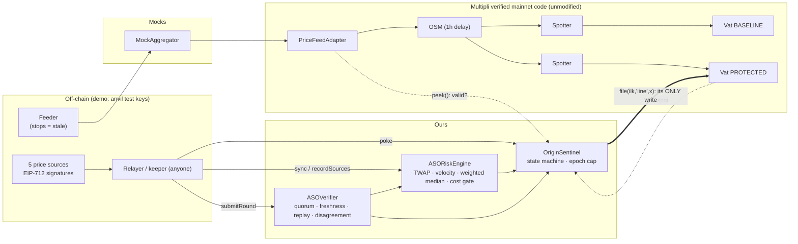

# Origin // ASO Sentinel

**Manipulation-cost-aware oracle protection and bounded-loss borrowing for a Multipli-style
(MakerDAO-fork) RWA lending market.**

Hackathon prototype for the Multipli Hackathon (GraVITas '26, VIT Vellore). Problem statement: Web3 oracle
reliability, accuracy and resilience.

> **What this is:** a tested prototype that runs **Multipli's own verified mainnet contracts** (Vat, Spotter,
> OSM, PriceFeedAdapter, GemJoin5) on a local chain, side by side **with and without** our protection layer.
> It includes a dashboard, a one-command on-chain demo, and a public Sepolia deployment of the v1 core.
>
> **What this is not:** it is not integrated with, deployed to, or endorsed by Multipli. It is not audited
> and not production-ready. It does **not** guarantee protection against manipulation or guarantee that
> bad debt is prevented: it **bounds** how much new debt can be created while data or market conditions
> look wrong. The liquidity depth and source weights are **assumptions set by governance**, not measured
> data.

## Contents

1. [Project overview](#1-project-overview)
2. [Problem statement](#2-problem-statement)
3. [Threat model](#3-threat-model)
4. [Why an oracle quorum alone is insufficient](#4-why-an-oracle-quorum-alone-is-insufficient)
5. [Architecture diagram](#5-architecture-diagram)
6. [Smart contract architecture](#6-smart-contract-architecture)
7. [Risk Engine](#7-risk-engine)
8. [Manipulation-cost model](#8-manipulation-cost-model)
9. [Sentinel state machine — five states, five different actions](#9-sentinel-state-machine--five-states-five-different-actions)
10. [Borrowing growth cap](#10-borrowing-growth-cap)
11. [Baseline versus protected](#11-baseline-versus-protected)
12. [Validation: false positives and false negatives](#12-validation-false-positives-and-false-negatives)
13. [Historical validation](#13-historical-validation)
14. [Known detection boundaries](#14-known-detection-boundaries)
15. [Installation](#15-installation)
16. [Local development (dashboard)](#16-local-development-dashboard)
17. [Tests](#17-tests)
18. [Demo](#18-demo)
19. [Deployment](#19-deployment)
20. [Contract addresses (verified)](#20-contract-addresses-verified)
21. [Transaction evidence](#21-transaction-evidence)
22. [Security assumptions](#22-security-assumptions)
23. [Known limitations](#23-known-limitations)
24. [Future improvements](#24-future-improvements)
25. [Judge presentation flow](#25-judge-presentation-flow)

**Status at a glance**

| | What |
|---|---|
| **Implemented** | `ASOVerifier`, `ASOSentinel` (v1); `ASORiskEngine`, `WeightedMedian`, `CostModel`, `OriginSentinel` (Origin); deploy scripts; CLI demos; dashboard |
| **Tested** | 183 Foundry tests (unit, fuzz, invariant) incl. 21 state/action-policy tests; 40 mutants all killed; validation suite of 38 + 19 holdout labelled cases with measured TP/FN/TN/FP ([docs/VALIDATION.md](docs/VALIDATION.md)); on-chain demos with 22/22 (v1) and 152/152 (Origin) expected outcomes; 9 dashboard unit tests |
| **Simulated** | price sources (anvil or team keys), the Chainlink-style feed, the collateral token, time (anvil time travel), the keeper, market depth (a governance input), and attacker behaviour in scenarios |
| **Planned (not done)** | Multipli integration (`vat.rely`), real independent sources, measured liquidity, keeper incentives, vault-integrity checks, timelock/multisig ownership, an external audit, an Origin Sepolia deployment |

---

## 1. Project overview

Multipli's rwaUSD market lends against a single price path (`feed → adapter → OSM → Spotter → Vat`). Origin
adds an independent, permissionless guard. It **never changes a collateral price**, so it cannot cause
liquidations. It controls exactly one thing: the collateral debt ceiling `line`.

- **v1 core** (`ASOVerifier` + `ASOSentinel`): signed N-of-M attestations with freshness, replay and
  disagreement checks. Borrowing closes when the data is stale, disputed or overvalued, and repayments keep
  working.
- **Origin layer** (`ASORiskEngine` + `OriginSentinel`): honest sources can still faithfully report a
  *manipulated market*. The Origin layer therefore also looks at TWAP deviation, velocity, source divergence
  and an explicit manipulation-cost estimate. It moves through FRESH / WATCH / DISPUTED / PROTECTIVE /
  RECOVERING, and caps debt growth per epoch so that residual exposure is **bounded**.

The v1 contracts are unchanged from the Sepolia deployment. Origin is added as new contracts next to them.

## 2. Problem statement

The following is verified in Multipli's deployed code (vendored byte-identical in [`src/multipli`](src/multipli);
see [docs/PROVENANCE.md](docs/PROVENANCE.md)):

- **The adapter detects staleness.** `PriceFeedAdapter.peek()` returns `(0, false)` when the feed is older than
  `maxDelay` (24h on mainnet).
- **The OSM discards that signal.** `OSM.poke()` does nothing when the adapter returns `false`, while
  `OSM.peek()` keeps returning its cached price with `has = true`.
- **The Vat keeps lending at that price.** It has no notion of freshness.
- **Invalidating the price is worse.** If the OSM reported "no price", the Spotter would set `spot = 0` and
  every vault would become liquidatable.
- **A fresh price can still be a manipulated price.** If the underlying market is pumped, every honest
  source reports the pumped value, the quorum is satisfied, and the Vat lends against it.

Mainnet configuration (read at block 26,009,365): `mat` 140%, OSM `hop` 3600s, adapter `maxDelay` 86,400s, ilk
`line` 1,000,000 rwaUSD, `dust` 100 rwaUSD. The demo uses the same values.

**Historical reference (Mango Markets, October 2022).** According to the
[SEC](https://www.sec.gov/newsroom/press-releases/2023-13) and
[CFTC](https://www.cftc.gov/PressRoom/PressReleases/8647-23) complaints, a trader allegedly pushed up the
price of MNGO on the exchanges that fed Mango's oracle (over 13-fold within about 30 minutes), then borrowed and
withdrew roughly $110–116 million against the inflated collateral value. These are regulators' allegations; a
federal judge later
[overturned the criminal convictions](https://www.trmlabs.com/resources/blog/breaking-federal-judge-overturns-all-criminal-convictions-in-mango-markets-case-against-avraham-eisenberg).
We cite the case only because it illustrates the mechanism: *an accurate oracle of a manipulated market*. We do
not claim Origin would have prevented it. Mango was a different system, and our cost model is a rough proxy.

## 3. Threat model

| Actor / failure | Can do | Origin response |
|---|---|---|
| Feed stops updating | OSM keeps an old price, Vat keeps lending | adapter `has=false` → PROTECTIVE; Vat price above effective price → PROTECTIVE |
| Minority of sources lie or break | submit outlier prices | no quorum, or DISPUTED (> 1% disagreement) → borrowing closed |
| Attacker without source keys | forge, replay, duplicate or reorder signatures | reverts (`InvalidSignature`, `NonceNotIncreasing`, `SignersNotStrictlyAscending`, …) |
| Market manipulator | moves the real market, so all honest sources agree on a bad price | TWAP deviation, velocity and the cost gate → WATCH or PROTECTIVE; epoch cap bounds what is left |
| Patient manipulator | holds the price longer than the TWAP window | **not fully detectable**; exposure bounded by WATCH headroom and the epoch cap (scenario B) |
| Keeper absent | nobody calls `poke()` | exposure bounded by the `line` set at the last poke |
| Admin | changes sources and parameters within bounds | out of scope; production needs a timelock/multisig |

Out of scope: a compromised majority of source keys, Multipli governance, L1 consensus, and liquidation
mechanics (Dog/Clipper are not deployed).

## 4. Why an oracle quorum alone is insufficient

A 3-of-5 quorum answers *"do independent sources agree on what the market says?"* It does not answer
*"is the market itself being manipulated?"* or *"is it worth manipulating?"* In scenario A, all five sources
honestly sign a +60% pumped price and the verifier returns `OK`. The baseline lends 285,000 rwaUSD that are
backed by 250,000 USD at the fair price. Origin looks at **how the price got there** (TWAP deviation and
velocity) and at **how cheap it would be to push it there** (the cost gate), and it limits **how much can be
borrowed at once** (the epoch cap).

## 5. Architecture diagram



## 6. Smart contract architecture

| Contract | Role | Size (runtime) |
|---|---|---|
| [`ASOVerifier`](src/ASOVerifier.sol) | EIP-712 N-of-M rounds; statuses `NO_DATA / OK / STALE / DISPUTED / HALTED`, computed at read time | v1, unchanged |
| [`ASOSentinel`](src/ASOSentinel.sol) | v1 guard: open/restricted on data health (deployed on Sepolia) | v1, unchanged |
| [`ASORiskEngine`](src/risk/ASORiskEngine.sol) | ring buffer of accepted rounds; TWAP, velocity, effective price, weighted median, cost quote | 11,185 B |
| [`OriginSentinel`](src/OriginSentinel.sol) | five-state machine, per-state `line`, epoch cap, full `snapshot()` view | 13,171 B |
| [`WeightedMedian`](src/risk/WeightedMedian.sol), [`CostModel`](src/risk/CostModel.sol) | pure libraries | — |

Deploy scripts: [`script/Deploy.s.sol`](script/Deploy.s.sol) (v1),
[`script/DeployOrigin.s.sol`](script/DeployOrigin.s.sol) (Origin; anvil only).
Full specification: **[docs/ORIGIN.md](docs/ORIGIN.md)**. v1 details: [docs/ARCHITECTURE.md](docs/ARCHITECTURE.md).

## 7. Risk Engine

The Risk Engine records every accepted verifier round (`sync()`, which the relayer must call after each
round) and derives:

- **TWAP** over 6h, which is valid only once history covers ≥ 50% of the window.
- **Spot deviation** from the TWAP, and **velocity** (% per hour) between the two latest rounds.
- **Effective price** = `min(attested, TWAP)`. Risk is judged on the more conservative of the two.
- **Weighted median** of individual source prices, re-verified from their signatures. Weights (30/25/20/15/10%)
  are configured, not measured. A gap of ≥ 0.5% from the verifier's plain median raises `SOURCE_DIVERGENCE`.

## 8. Manipulation-cost model

A transparent proxy computed on-chain by [`CostModel.sol`](src/risk/CostModel.sol); every input is visible and
adjustable in the dashboard's Cost Lab.

| Variable | Meaning |
|---|---|
| `d` | how much the attacker tries to inflate the price (fraction) |
| `D` | market-depth **assumption**: USD needed to move the price by 1% — set by governance, not measured |
| `H` | new debt the attacker could take right now = the Sentinel's FRESH headroom |
| `lossShare` | assumed share of (capital × move) lost unwinding the position (50%) |
| `mat` | liquidation ratio (140%) |

```
capital(d)     = D × (d in %)                   capital needed to move the price
cost(d)        = capital(d) × d × lossShare     modelled attack cost (note the factor d)
extractable(d) = H × max(0, 1 − mat/(1 + d))    debt taken beyond the TRUE value of the posted collateral
ratio          = min over d ∈ {45%, 55%, 70%, 100%} of cost/extractable   (d0 + 5, 15, 30, 60 points; d0 = mat − 1 = 40%)
LOW ≥ 3× · ELEVATED 1–3× (→ WATCH) · HIGH < 1× (→ PROTECTIVE) · INSUFFICIENT_DATA if depth missing/stale (→ WATCH)
```

*Implementation note:* the current implementation applies the price-move factor d to the assumed unwind loss (`cost = capital × d × lossShare`). This release preserves the tested implementation.

**This is a simplified economic proxy.** It does not model order books, multiple venues, flash loans, MEV,
cross-venue arbitrage, attacker coordination, liquidation cascades or non-linear slippage, and it has no real
liquidity data. Correct reading: *under the stated assumptions, the modelled attack cost exceeds the modelled
extractable value* — never "the attack is impossible". A sensitivity analysis (three depth assumptions × six
inflation levels, every point from the deployed `quote()`) is in [docs/VALIDATION.md §10](docs/VALIDATION.md) and live
in the Cost Lab.

## 9. Sentinel state machine — five states, five different actions

The market needs more than accept/reject: each state maps to a different, **enforced** debt ceiling.
`OriginSentinel.policyLine(state)` returns that ceiling from the same code `poke()` applies, and
[`test/OriginPolicy.t.sol`](test/OriginPolicy.t.sol) proves every row.

| State | Meaning | Trigger | Borrowing action | Debt ceiling | Repayment | Recovery |
|---|---|---|---|---|---|---|
| **FRESH** | healthy | no flag | normal | `min(debt + gap, maxLine, epoch cap)` | ✓ | — |
| **WATCH** | real warning, not enough to freeze | TWAP ≥ 3%, velocity ≥ 5%/h, cost ELEVATED or no depth data, thin TWAP history, source divergence, only the minimum quorum of sources online | **limited** (25% of the normal gap) | `min(debt + 0.25·gap, maxLine, epoch cap)` | ✓ | automatic when the warning clears |
| **DISPUTED** | no trustworthy price | latest round's sources spread > 1% | **frozen** | `0` | ✓ | → RECOVERING after an agreeing round |
| **PROTECTIVE** | data may be valid, lending more is dangerous | stale/missing/halted data, Multipli feed stale, Vat lending > 2% above min(market, 6 h TWAP), TWAP ≥ 15%, velocity ≥ 20%/h, cost HIGH | **frozen** | `0` | ✓ | → RECOVERING when every signal clears |
| **RECOVERING** | danger cleared, stability unproven | signals cleared after DISPUTED/PROTECTIVE | **still frozen** | `0` | ✓ | newer accepted round **and** 1 h delay; a relapse sends it straight back |

There is no direct PROTECTIVE → FRESH transition; RECOVERING exists so that *attack → brief normalisation → borrowing
reopens → attack resumes* cannot happen (tested: `test_Recovering_KeepsFreeze_UntilNewRoundAndDelay_AndReRestrictsOnRelapse`,
validation case R2). Every transition happens on a permissionless `poke()` and emits `StateChanged`. The contract is
deployed PROTECTIVE (fail closed).

## 10. Borrowing growth cap

`line ≤ epochStartDebt + growthCap` (100,000 rwaUSD per 1-day epoch in the demo). This holds even in FRESH.
It limits how much debt can be created before detection catches up. The invariant suite checks that debt never
exceeds this cap.

## 11. Baseline versus protected

Both markets read the **same** Multipli OSM price. Figures come from `test/OriginScenarios.t.sol` and the
on-chain demo.

| Scenario | Baseline (Multipli alone) | Protected (Origin) |
|---|---|---|
| A. Thin-market pump +60%, all sources agree | lends 285,000 rwaUSD on 100 PAXG; **35,000 bad debt** at the $2,500 fair price | PROTECTIVE from the first pumped round; borrow reverts `Vat/ceiling-exceeded` |
| B. Pump held longer than the TWAP window | borrows up to collateral and its 1M line | TWAP catches up (**a documented limit**); reopens only in WATCH with ≤ 25% headroom and within the epoch cap; the baseline borrows > 5× more |
| C. Honest +0.5%/h for 8 h | lends | stays FRESH (no false alarm) |
| D. Feed frozen while the market falls 40% | lends at the old price; **28,000 bad debt** at $1,500 | PROTECTIVE (Vat above effective price) |
| E. Sources disagree | n/a | DISPUTED → repay works → RECOVERING → FRESH only after a newer round |

## 12. Validation: false positives and false negatives

`cd demo && npm run validate` runs a labelled suite against the real contracts on a fresh local chain and computes the
metrics from what the Sentinel actually did. Ground truth (risk / healthy / degraded) is fixed per case before running;
after every `poke()` the harness records state, flags and ceiling and probes (`eth_call`) whether a borrow and a
repayment would succeed. Full report, per-case tables and analysis: **[docs/VALIDATION.md](docs/VALIDATION.md)**.

| Result set | N (risk / healthy / degraded) | TP | FN | TN | FP | Recall | Precision | FP rate |
|---|---|---|---|---|---|---|---|---|
| Final rules — main suite | 38 (29 / 8 / 1) | 27 | 2 | 4 | 4 | 93.1% | 87.1% | 50.0% |
| Final rules — holdout suite (written before any rule change) | 19 (11 / 7 / 1) | 10 | 1 | 2 | 5 | 90.9% | 66.7% | 71.4% |

- **Coverage:** healthy and volatile markets, thin-market pumps, sustained and creeping manipulation, sub-threshold
  manipulation, stale and frozen feeds, conflicting sources, forged / unauthorised / replayed / expired / duplicated /
  sub-quorum rounds, **source availability 5/5 → 0/5**, **1–4 of 5 sources lying** (all signatures relayed →
  DISPUTED) and **3–5 of 5 colluding with only their valid signatures relayed** (verifier accepts; the risk engine
  freezes), recovery and relapse. Invariants were checked at every poke (0 violations) and every state transition was
  checked against the transition rules (0 violations).
- **False negatives:** A4 / X11 — a manipulation held longer than the 6 h TWAP window (protected for 6 of 8–10 hours,
  then borrowing reopens; bounded by the daily growth cap); A6 — a +2.5% manipulation below every threshold (and
  unprofitable at a 140% liquidation ratio).
- **False positives:** honest trends, spikes and declines. Most come from the fixed 2% Vat-price tolerance against
  Multipli's OSM, whose queued price lags the market by up to 2 hours.
- **A rule change was evaluated and rejected:** an alternative Vat rule (`GRADED`) was proposed from design reasoning,
  evaluated on both suites and rejected — it changed no TP/FN/TN/FP count and traded two frozen hours in honest rallies
  for two frozen hours in sustained attacks. Baseline, candidate and final results are all preserved in `validation/`;
  the final rules equal the baseline rules.
- **Read these as behaviour on a synthetic, team-built suite — not real-world detection rates.**

## 13. Historical validation

Six documented incidents, each with sources, kept in four separate layers: **historical fact** (only what the sources
state), **retrospective mapping** (our interpretation), **reproduced test** (the pattern with synthetic prices) and
**not modeled**. No historical data is replayed and no claim is made that Origin would have prevented any of them.

| Incident | Pattern | Reproduced as |
|---|---|---|
| Synthetix sKRW oracle, Jun 2019 ([Synthetix](https://blog.synthetix.io/response-to-oracle-incident/)) | faulty source, too few sources | S2, M1, F3 |
| bZx, Feb 2020 ([Qin et al., FC 2021](https://arxiv.org/abs/2003.03810)) | in-transaction DEX price manipulation | A2 (flash-loan atomicity not modeled) |
| Compound DAI liquidations, Nov 2020 ([Compound forum](https://www.comp.xyz/t/dai-liquidation-event/642)) | single-venue price spike | A2 (liquidations out of scope) |
| Inverse Finance, Apr 2022 ([CertiK](https://www.certik.com/resources/blog/inverse-finance-02-april-2022)) | thin-liquidity pool + TWAP oracle | A1, A3, A4 |
| Venus LUNA, May 2022 ([The Record](https://therecord.media/collapse-of-luna-cryptocurrency-leads-to-11-million-exploit-on-venus-protocol)) | upstream feed stopped while the market fell | F1, F2 |
| Mango Markets, Oct 2022 ([CFTC](https://www.cftc.gov/PressRoom/PressReleases/8647-23), [SEC](https://www.sec.gov/newsroom/press-releases/2023-13)) | thin-market pump reported honestly by the oracle | A1, V5 |

Facts, mappings and limits for each: [docs/VALIDATION.md §11](docs/VALIDATION.md) and the dashboard's Validation page.

## 14. Known detection boundaries

What Origin does **not** claim to protect against — limits of scope, not failures of the concept (the goal is bounded
loss, not guaranteed safety):

1. **Long-duration manipulation can enter the TWAP window** (A4, X11). The daily growth cap and WATCH headroom bound
   borrowing; they do not detect it.
2. **Small manipulation can stay below thresholds** (A6).
3. **Manipulation-cost results depend on the market-depth assumption.**
4. **A compromised source majority passes the verifier**; only the economic signals can object, and only for large or
   fast moves (V3–V5).
5. **Demo oracle sources are controlled test keys**, not independent providers.
6. **Prototype, not an audited production deployment**; liquidations and collateral withdrawal are out of scope.

## 15. Installation

Requires [Foundry](https://book.getfoundry.sh/) v1.8.3 and Node ≥ 20.

```bash
git clone --recurse-submodules https://github.com/AnantSharmaDev768/aso-sentinel.git
cd aso-sentinel
forge build
(cd demo && npm ci)
(cd app && npm ci)
```

## 16. Local development (dashboard)

```bash
cd app
npm run local
```

This starts anvil on `127.0.0.1:8545`, deploys with `forge script script/DeployOrigin.s.sol`, bootstraps the
healthy FRESH state with real transactions, takes a chain snapshot, and serves the dashboard at
<http://localhost:5173>. Ctrl+C stops both.

- **Demo mode, no wallet.** Transactions are signed by anvil's **public** test accounts and are sent only to
  chain id 31337. The dashboard refuses other networks, and it shows loading, no-deployment, no-chain and
  wrong-network states.
- **Reset chain** rewinds to the healthy snapshot, so every scenario is reproducible.
- Views: Overview, Oracle Monitoring, Sentinel State, Baseline vs Protected, Manipulation Cost Lab, Scenarios &
  Log, **Validation**, Evidence, Presentation Mode.
- Values from contracts are labelled as such. Browser-side analytics (weakest link, bad-debt estimate) are
  labelled as estimates. The Evidence view separates LOCAL, SEPOLIA (committed files) and SIMULATED data.

## 17. Tests

```bash
forge test                               # 183 tests: unit, fuzz, invariant
forge fmt --check
python test/mutation/run_mutations.py    # 40 mutants, each must be killed
cd demo && npm run validate               # labelled validation suite -> validation/, docs/VALIDATION.md
node shared/gen-abis.mjs --check         # ABIs used by demo/dashboard match the build
cd app && npm run lint && npm test && npm run build
```

| Suite | Tests |
|---|---|
| ASOVerifier / ASOSentinel / AttackScenarios / SentinelInvariants (v1) | 55 / 21 / 14 / 1 |
| RiskLibraries (WeightedMedian + CostModel) | 10 + 8 |
| ASORiskEngine | 22 |
| OriginSentinel | 25 |
| OriginPolicy (state/action matrix, source availability, coordinated manipulation, Vat rule modes) | 21 |
| OriginScenarios (A–E) | 5 |
| OriginInvariants: one invariant test checking 8 properties (128 runs × 64 calls) | 1 |

CI ([.github/workflows/test.yml](.github/workflows/test.yml)) runs all of the above, including mutation testing,
plus both demos and a headless local deploy.

## 18. Demo

```bash
cd demo
npm run demo          # v1: 22 expected-vs-actual checks (~15 s)
npm run demo:step     # v1, paused between scenarios for live narration
npm run demo:origin   # Origin: items 1–16, scenarios A–E, presentation sequence — 152 checks (~30 s)
npm run validate      # validation suite, final rules, main + holdout (~2 min); -- --rules=baseline for the original
```

Each demo starts its own anvil, deploys, and runs every step as **mined transactions**, including expected
reverts, whose decoded reasons are printed. It ends with an expected-vs-actual summary and **exits non-zero**
on any unexpected outcome. Talk track: [docs/DEMO.md](docs/DEMO.md).

## 19. Deployment

- **Local (Origin):** `forge script script/DeployOrigin.s.sol --rpc-url http://127.0.0.1:8545 --broadcast`.
  It refuses any chain except 31337 because it uses public test keys. `npm run local` does this for you.
- **Sepolia (v1 core):** documented in [docs/SEPOLIA.md](docs/SEPOLIA.md). It uses a gitignored `.env.sepolia`,
  and keys never enter the repo.
- **Origin on Sepolia: not deployed.** It would need a dedicated script with non-test keys, shortened timings
  and a relayer that calls `sync()`. We did not redeploy, so as not to disturb the verified v1 evidence.

## 20. Contract addresses (verified)

Ethereum Sepolia (chain `11155111`), **v1 core only**. All 12 contracts are source-verified on Sourcify (exact
match). The full list is in [docs/SEPOLIA.md](docs/SEPOLIA.md).

- **`ASOSentinel`:** [`0xbd83Ce0AAf941D87Af2fB50C0B4fF04Dd20FB0b2`](https://eth-sepolia.blockscout.com/address/0xbd83Ce0AAf941D87Af2fB50C0B4fF04Dd20FB0b2?tab=contract)
- **`ASOVerifier`:** [`0x7a46253E1722b52387a0bac610a2CFD18458530B`](https://eth-sepolia.blockscout.com/address/0x7a46253E1722b52387a0bac610a2CFD18458530B?tab=contract)

Blockscout shows the verified source. Etherscan shows the transactions but not the source. `ASORiskEngine`
and `OriginSentinel` have **no public address**; local addresses are disposable.

## 21. Transaction evidence

- **Sepolia:** the runner (`npm run demo:sepolia`) passed **27/27 checks in each of two runs**. Every linked
  transaction was checked against the chain. Evidence: addresses in
  [`deployments/11155111.json`](deployments/11155111.json); Run 2's raw output in
  [`deployments/11155111-scenarios-run2.json`](deployments/11155111-scenarios-run2.json) (27 checks, all
  passing). Run 1's raw file was overwritten, so Run 1 is evidenced by the on-chain transactions linked in
  [docs/SEPOLIA.md](docs/SEPOLIA.md). The Sepolia runs use
  shortened timing and exclude the 25h stale-feed case.
- **Local:** every demo and dashboard action shows its tx hash, block and decoded revert reason. These are
  local anvil transactions and are labelled as such.

## 22. Security assumptions

1. A majority of source keys (3 of 5) is honest and independent. In the demo they are team-controlled keys.
2. Someone calls `poke()` (and `sync()`) regularly. There is no keeper incentive yet.
3. The governance depth assumption and source weights are reasonable and kept up to date. A stale depth value
   degrades to INSUFFICIENT_DATA, which means WATCH.
4. The owner is trusted within parameter bounds. The demo uses one EOA; production needs a timelock/multisig.
5. Multipli governance would have to `rely` the Sentinel on the Vat. Its only privilege is setting `line`, and
   never above `maxLine`.

## 23. Known limitations

See also [Known detection boundaries](#14-known-detection-boundaries).

1. **Sustained manipulation becomes the TWAP.** Origin bounds the loss (WATCH headroom, epoch cap); it does
   not detect this indefinitely.
2. **The cost model is a proxy.** Depth is an input, not measured liquidity. The model can be wrong in either
   direction.
3. **Collateral withdrawal is not blocked.** The Vat still lets users withdraw down to a stale-high `spot`
   (`test_KnownLimitation_CollateralWithdrawalAtStalePriceNotBlocked`). Fixing it needs a Vat-level hook.
4. **Vault and collateral-integrity (donation) checks are not implemented.** The Vat exposes no total
   collateral per ilk to check against.
5. **Keeper and relayer dependency.** Between pokes, exposure is bounded by the last `line`.
6. **A single faulty source can force DISPUTED** (fail closed: borrowing pauses, nothing is liquidated).
7. **The relayer chooses among valid signatures.** Its influence is bounded by the 1% agreement band.
8. **Not audited. Origin is local only. Not integrated with Multipli.**

## 24. Future improvements

- On-chain or attested liquidity depth instead of a governance number, and measured source-quality weights.
- Keeper incentives, and automatic `sync()` inside the verifier's round submission.
- A Vat-level hook to gate collateral withdrawals, and vault-integrity checks where interfaces allow.
- A timelock/multisig for admin roles, an Origin Sepolia deployment with a relayer, and an external audit.

## 25. Judge presentation flow

Run `cd app && npm run local`, open **Presentation mode**, and click through (about 3 minutes). Each step sends
real local transactions:

1. **Healthy:** 3-of-5 rounds, FRESH, Alice has borrowed on both markets.
2. **Disagreement:** sources split → DISPUTED, and the ceiling closes.
3. **Cost warning:** thin-market depth assumption → the cost gate raises ELEVATED.
4. **Protective:** a +60% pump that every source reports → PROTECTIVE; Bob's borrow reverts.
5. **Repayment:** Alice repays while restricted, which succeeds.
6. **Fresh round:** hourly honest rounds until the signals clear → RECOVERING (never straight to FRESH).
7. **Recovery:** a newer round plus the delay reopens borrowing — limited (WATCH) while the TWAP still remembers the
   pump, then FRESH once the 6 h window rolls past it.

Then show **Validation** (measured TP/FN/TN/FP, the rejected rule change, every miss explained), **Baseline vs
protected** (same OSM price, different outcome), the **Cost Lab** formulas, and the **Evidence** view (the verified
Sepolia v1 contracts). **Reset chain** returns to step 1.

## Prior art

Aave `PriceOracleSentinel` (a borrowing pause on oracle/sequencer failure), MakerDAO `DssAutoLine` (the
headroom pattern), RedStone and Chainlink Data Streams (signed timestamped reports), Pyth (freshness bounds and
confidence), and Multipli's own documented N-of-M oracle-profile statuses. Our contribution is a working, tested
combination of these ideas, wired to Multipli's actual contracts.

## License

AGPL-3.0-or-later. The vendored Multipli (MakerDAO/dss-derived) sources are AGPL-3.0 / GPL-3.0; see their
headers.
