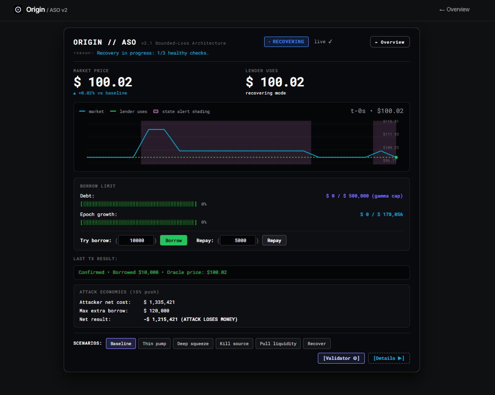
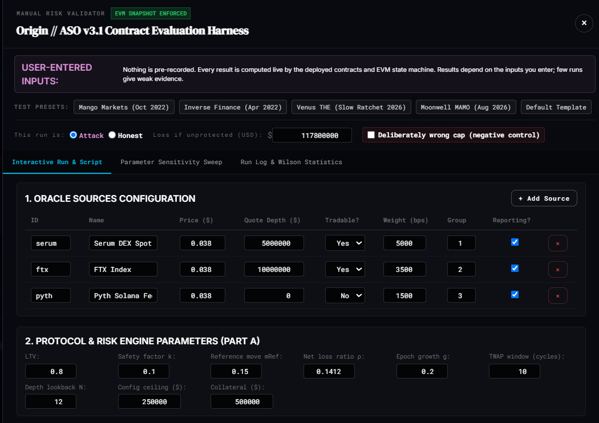
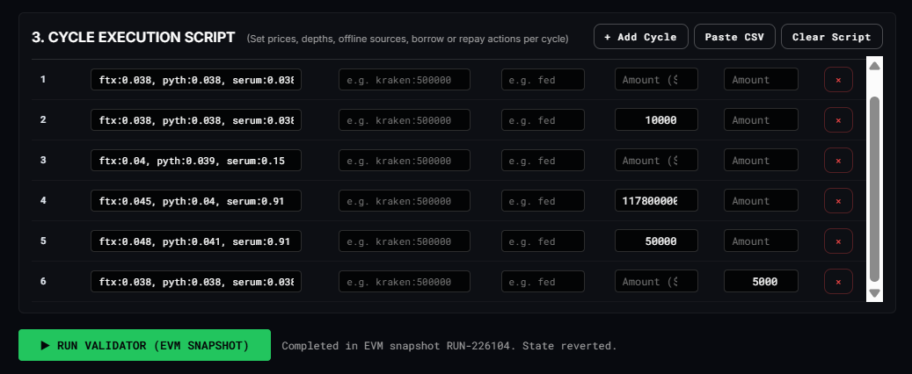
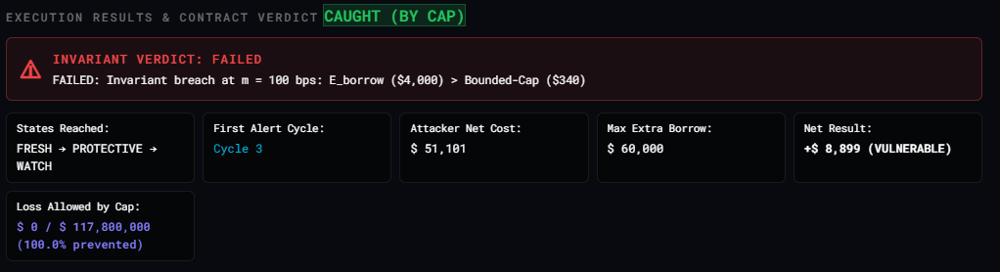
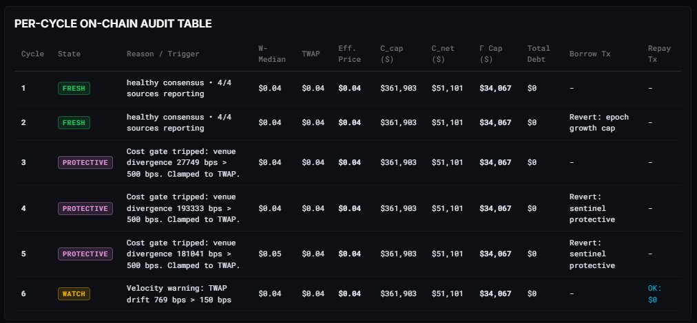
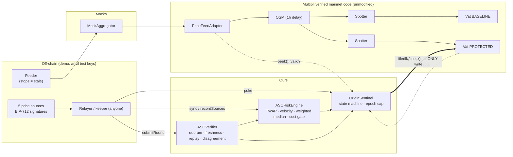

# ORIGIN — Economic Exposure Guard (EEG)

> **On-chain Economic Exposure Guard that limits how quickly a lending market can create new debt, ensuring that even a manipulated oracle cannot be converted into an unlimited instantaneous liquidity drain.**

Repository: `https://github.com/AnantSharmaDev768/aso-sentinel` (Multipli Hackathon 2026)  
Active Branch: `feat/economic-exposure-guard`

---

## 🎯 The Core Thesis

Oracle manipulation attacks (e.g. Mango Markets, Inverse Finance, Platypus, Venus) become catastrophic when a false or manipulated collateral price can **instantly unlock 100% of the remaining borrowing liquidity** in a lending market within a single transaction.

Instead of trying to prove whether an oracle is "truthful" or "honest" (an undecidable problem under deep manipulation or private mempool attacks), **ORIGIN EEG** enforces a mathematical debt-velocity invariant:

$$\Delta \text{Debt}_{\text{new}} \le \text{Capacity}_0 + R_{\text{max}} \times \Delta t$$

**Meaning:** Aggregate newly originated debt across the entire lending market cannot exceed the configured debt-expansion capacity over time.

---

## 🛡️ Key Architectural Invariants

1. **Token-Bucket Debt Rate Limiter:**
   - `maxCapacity`: Configured burst borrowing allowance (e.g., $\$100,000$).
   - `refillRatePerSecond`: Linear capacity replenishment over time (e.g., $\$25,000$ per 15 minutes = $\$27.78/\text{sec}$).
   - `currentCapacity`: Capacity remaining for new debt creation.
2. **Repayments Do NOT Refill the Bucket (Anti-Churn Invariant):**
   - Repayments reduce user and market debt, but **never increase EEG capacity**.
   - This prevents attackers from looping flash-loan borrows and repayments to bypass the rate limit.
3. **Repayments and Liquidations Are 100% Ungated:**
   - `repay()` and `liquidate()` execute with zero rate-limit checks in all protocol states. Emergency de-leveraging is never throttled.
4. **Seamless Normal UX:**
   - Honest small borrowers (e.g., $\$2,900$) experience zero friction: 1 normal transaction, normal gas, no KYC, no approvals, no keepers.
5. **Sybil & Flash Loan Resistant:**
   - Capacity is market-wide and aggregate. Splitting $\$10\text{M}$ into 100 or 1,000 distinct wallets or contracts hits the exact same shared token bucket.

---
## Interface Showcase



**Validator used for Mango Market Case in 2022**







## 1. Project overview

Multipli's rwaUSD market lends against a single price path (`feed → adapter → OSM → Spotter → Vat`). Origin
adds an independent, permissionless guard. It **never changes a collateral price**, so it cannot cause
liquidations. It controls exactly one thing: the collateral debt ceiling `line`.

- **v1 core** (`ASOVerifier` + `ASOSentinel`): signed N-of-M attestations with freshness, replay and
  disagreement checks. Borrowing closes when the data is stale, disputed or overvalued, and repayments keep
  working.
- **Origin layer** (`ASORiskEngine` + `OriginSentinel`): honest sources can still faithfully report a
  *manipulated market*. The Origin layer therefore also looks at TWAP deviation, velocity, source divergence
  and an explicit manipulation-cost estimate. It moves through FRESH / WATCH / DISPUTED / PROTECTIVE /
  RECOVERING, and caps debt growth per epoch so that residual exposure is **bounded**.

The v1 contracts are unchanged from the Sepolia deployment. Origin is added as new contracts next to them.

## 2. Problem statement

The following is verified in Multipli's deployed code (vendored byte-identical in [`src/multipli`](src/multipli);
see [docs/PROVENANCE.md](docs/PROVENANCE.md)):

- **The adapter detects staleness.** `PriceFeedAdapter.peek()` returns `(0, false)` when the feed is older than
  `maxDelay` (24h on mainnet).
- **The OSM discards that signal.** `OSM.poke()` does nothing when the adapter returns `false`, while
  `OSM.peek()` keeps returning its cached price with `has = true`.
- **The Vat keeps lending at that price.** It has no notion of freshness.
- **Invalidating the price is worse.** If the OSM reported "no price", the Spotter would set `spot = 0` and
  every vault would become liquidatable.
- **A fresh price can still be a manipulated price.** If the underlying market is pumped, every honest
  source reports the pumped value, the quorum is satisfied, and the Vat lends against it.

Mainnet configuration (read at block 26,009,365): `mat` 140%, OSM `hop` 3600s, adapter `maxDelay` 86,400s, ilk
`line` 1,000,000 rwaUSD, `dust` 100 rwaUSD. The demo uses the same values.

**Historical reference (Mango Markets, October 2022).** According to the
[SEC](https://www.sec.gov/newsroom/press-releases/2023-13) and
[CFTC](https://www.cftc.gov/PressRoom/PressReleases/8647-23) complaints, a trader allegedly pushed up the
price of MNGO on the exchanges that fed Mango's oracle (over 13-fold within about 30 minutes), then borrowed and
withdrew roughly $110–116 million against the inflated collateral value. These are regulators' allegations; a
federal judge later
[overturned the criminal convictions](https://www.trmlabs.com/resources/blog/breaking-federal-judge-overturns-all-criminal-convictions-in-mango-markets-case-against-avraham-eisenberg).
We cite the case only because it illustrates the mechanism: *an accurate oracle of a manipulated market*. We do
not claim Origin would have prevented it. Mango was a different system, and our cost model is a rough proxy.

## 3. Threat model

| Actor / failure | Can do | Origin response |
|---|---|---|
| Feed stops updating | OSM keeps an old price, Vat keeps lending | adapter `has=false` → PROTECTIVE; Vat price above effective price → PROTECTIVE |
| Minority of sources lie or break | submit outlier prices | no quorum, or DISPUTED (> 1% disagreement) → borrowing closed |
| Attacker without source keys | forge, replay, duplicate or reorder signatures | reverts (`InvalidSignature`, `NonceNotIncreasing`, `SignersNotStrictlyAscending`, …) |
| Market manipulator | moves the real market, so all honest sources agree on a bad price | TWAP deviation, velocity and the cost gate → WATCH or PROTECTIVE; epoch cap bounds what is left |
| Patient manipulator | holds the price longer than the TWAP window | **not fully detectable**; exposure bounded by WATCH headroom and the epoch cap (scenario B) |
| Keeper absent | nobody calls `poke()` | exposure bounded by the `line` set at the last poke |
| Admin | changes sources and parameters within bounds | out of scope; production needs a timelock/multisig |

Out of scope: a compromised majority of source keys, Multipli governance, L1 consensus, and liquidation
mechanics (Dog/Clipper are not deployed).

## 4. Why an oracle quorum alone is insufficient

A 3-of-5 quorum answers *"do independent sources agree on what the market says?"* It does not answer
*"is the market itself being manipulated?"* or *"is it worth manipulating?"* In scenario A, all five sources
honestly sign a +60% pumped price and the verifier returns `OK`. The baseline lends 285,000 rwaUSD that are
backed by 250,000 USD at the fair price. Origin looks at **how the price got there** (TWAP deviation and
velocity) and at **how cheap it would be to push it there** (the cost gate), and it limits **how much can be
borrowed at once** (the epoch cap).

## 5. Architecture diagram



## 6. Smart contract architecture

| Contract | Role | Size (runtime) |
|---|---|---|
| [`ASOVerifier`](src/ASOVerifier.sol) | EIP-712 N-of-M rounds; statuses `NO_DATA / OK / STALE / DISPUTED / HALTED`, computed at read time | v1, unchanged |
| [`ASOSentinel`](src/ASOSentinel.sol) | v1 guard: open/restricted on data health (deployed on Sepolia) | v1, unchanged |
| [`ASORiskEngine`](src/risk/ASORiskEngine.sol) | ring buffer of accepted rounds; TWAP, velocity, effective price, weighted median, cost quote | 11,185 B |
| [`OriginSentinel`](src/OriginSentinel.sol) | five-state machine, per-state `line`, epoch cap, full `snapshot()` view | 13,171 B |
| [`WeightedMedian`](src/risk/WeightedMedian.sol), [`CostModel`](src/risk/CostModel.sol) | pure libraries | — |

Deploy scripts: [`script/Deploy.s.sol`](script/Deploy.s.sol) (v1),
[`script/DeployOrigin.s.sol`](script/DeployOrigin.s.sol) (Origin; anvil only).
Full specification: **[docs/ORIGIN.md](docs/ORIGIN.md)**. v1 details: [docs/ARCHITECTURE.md](docs/ARCHITECTURE.md).

## 7. Risk Engine

The Risk Engine records every accepted verifier round (`sync()`, which the relayer must call after each
round) and derives:

- **TWAP** over 6h, which is valid only once history covers ≥ 50% of the window.
- **Spot deviation** from the TWAP, and **velocity** (% per hour) between the two latest rounds.
- **Effective price** = `min(attested, TWAP)`. Risk is judged on the more conservative of the two.
- **Weighted median** of individual source prices, re-verified from their signatures. Weights (30/25/20/15/10%)
  are configured, not measured. A gap of ≥ 0.5% from the verifier's plain median raises `SOURCE_DIVERGENCE`.

## 8. Manipulation-cost model

A transparent proxy computed on-chain by [`CostModel.sol`](src/risk/CostModel.sol); every input is visible and
adjustable in the dashboard's Cost Lab.

| Variable | Meaning |
|---|---|
| `d` | how much the attacker tries to inflate the price (fraction) |
| `D` | market-depth **assumption**: USD needed to move the price by 1% — set by governance, not measured |
| `H` | new debt the attacker could take right now = the Sentinel's FRESH headroom |
| `lossShare` | assumed share of (capital × move) lost unwinding the position (50%) |
| `mat` | liquidation ratio (140%) |

```
capital(d)     = D × (d in %)                   capital needed to move the price
cost(d)        = capital(d) × d × lossShare     modelled attack cost (note the factor d)
extractable(d) = H × max(0, 1 − mat/(1 + d))    debt taken beyond the TRUE value of the posted collateral
ratio          = min over d ∈ {45%, 55%, 70%, 100%} of cost/extractable   (d0 + 5, 15, 30, 60 points; d0 = mat − 1 = 40%)
LOW ≥ 3× · ELEVATED 1–3× (→ WATCH) · HIGH < 1× (→ PROTECTIVE) · INSUFFICIENT_DATA if depth missing/stale (→ WATCH)
```

*Implementation note:* the current implementation applies the price-move factor d to the assumed unwind loss (`cost = capital × d × lossShare`). This release preserves the tested implementation.

**This is a simplified economic proxy.** It does not model order books, multiple venues, flash loans, MEV,
cross-venue arbitrage, attacker coordination, liquidation cascades or non-linear slippage, and it has no real
liquidity data. Correct reading: *under the stated assumptions, the modelled attack cost exceeds the modelled
extractable value* — never "the attack is impossible". A sensitivity analysis (three depth assumptions × six
inflation levels, every point from the deployed `quote()`) is in [docs/VALIDATION.md §10](docs/VALIDATION.md) and live
in the Cost Lab.

## 9. Sentinel state machine — five states, five different actions

The market needs more than accept/reject: each state maps to a different, **enforced** debt ceiling.
`OriginSentinel.policyLine(state)` returns that ceiling from the same code `poke()` applies, and
[`test/OriginPolicy.t.sol`](test/OriginPolicy.t.sol) proves every row.

| State | Meaning | Trigger | Borrowing action | Debt ceiling | Repayment | Recovery |
|---|---|---|---|---|---|---|
| **FRESH** | healthy | no flag | normal | `min(debt + gap, maxLine, epoch cap)` | ✓ | — |
| **WATCH** | real warning, not enough to freeze | TWAP ≥ 3%, velocity ≥ 5%/h, cost ELEVATED or no depth data, thin TWAP history, source divergence, only the minimum quorum of sources online | **limited** (25% of the normal gap) | `min(debt + 0.25·gap, maxLine, epoch cap)` | ✓ | automatic when the warning clears |
| **DISPUTED** | no trustworthy price | latest round's sources spread > 1% | **frozen** | `0` | ✓ | → RECOVERING after an agreeing round |
| **PROTECTIVE** | data may be valid, lending more is dangerous | stale/missing/halted data, Multipli feed stale, Vat lending > 2% above min(market, 6 h TWAP), TWAP ≥ 15%, velocity ≥ 20%/h, cost HIGH | **frozen** | `0` | ✓ | → RECOVERING when every signal clears |
| **RECOVERING** | danger cleared, stability unproven | signals cleared after DISPUTED/PROTECTIVE | **still frozen** | `0` | ✓ | newer accepted round **and** 1 h delay; a relapse sends it straight back |

There is no direct PROTECTIVE → FRESH transition; RECOVERING exists so that *attack → brief normalisation → borrowing
reopens → attack resumes* cannot happen (tested: `test_Recovering_KeepsFreeze_UntilNewRoundAndDelay_AndReRestrictsOnRelapse`,
validation case R2). Every transition happens on a permissionless `poke()` and emits `StateChanged`. The contract is
deployed PROTECTIVE (fail closed).

## 10. Borrowing growth cap

`line ≤ epochStartDebt + growthCap` (100,000 rwaUSD per 1-day epoch in the demo). This holds even in FRESH.
It limits how much debt can be created before detection catches up. The invariant suite checks that debt never
exceeds this cap.

## 11. Baseline versus protected

Both markets read the **same** Multipli OSM price. Figures come from `test/OriginScenarios.t.sol` and the
on-chain demo.

| Scenario | Baseline (Multipli alone) | Protected (Origin) |
|---|---|---|
| A. Thin-market pump +60%, all sources agree | lends 285,000 rwaUSD on 100 PAXG; **35,000 bad debt** at the $2,500 fair price | PROTECTIVE from the first pumped round; borrow reverts `Vat/ceiling-exceeded` |
| B. Pump held longer than the TWAP window | borrows up to collateral and its 1M line | TWAP catches up (**a documented limit**); reopens only in WATCH with ≤ 25% headroom and within the epoch cap; the baseline borrows > 5× more |
| C. Honest +0.5%/h for 8 h | lends | stays FRESH (no false alarm) |
| D. Feed frozen while the market falls 40% | lends at the old price; **28,000 bad debt** at $1,500 | PROTECTIVE (Vat above effective price) |
| E. Sources disagree | n/a | DISPUTED → repay works → RECOVERING → FRESH only after a newer round |

## 12. Validation: false positives and false negatives

`cd demo && npm run validate` runs a labelled suite against the real contracts on a fresh local chain and computes the
metrics from what the Sentinel actually did. Ground truth (risk / healthy / degraded) is fixed per case before running;
after every `poke()` the harness records state, flags and ceiling and probes (`eth_call`) whether a borrow and a
repayment would succeed. Full report, per-case tables and analysis: **[docs/VALIDATION.md](docs/VALIDATION.md)**.

| Result set | N (risk / healthy / degraded) | TP | FN | TN | FP | Recall | Precision | FP rate |
|---|---|---|---|---|---|---|---|---|
| Final rules — main suite | 38 (29 / 8 / 1) | 27 | 2 | 4 | 4 | 93.1% | 87.1% | 50.0% |
| Final rules — holdout suite (written before any rule change) | 19 (11 / 7 / 1) | 10 | 1 | 2 | 5 | 90.9% | 66.7% | 71.4% |

- **Coverage:** healthy and volatile markets, thin-market pumps, sustained and creeping manipulation, sub-threshold
  manipulation, stale and frozen feeds, conflicting sources, forged / unauthorised / replayed / expired / duplicated /
  sub-quorum rounds, **source availability 5/5 → 0/5**, **1–4 of 5 sources lying** (all signatures relayed →
  DISPUTED) and **3–5 of 5 colluding with only their valid signatures relayed** (verifier accepts; the risk engine
  freezes), recovery and relapse. Invariants were checked at every poke (0 violations) and every state transition was
  checked against the transition rules (0 violations).
- **False negatives:** A4 / X11 — a manipulation held longer than the 6 h TWAP window (protected for 6 of 8–10 hours,
  then borrowing reopens; bounded by the daily growth cap); A6 — a +2.5% manipulation below every threshold (and
  unprofitable at a 140% liquidation ratio).
- **False positives:** honest trends, spikes and declines. Most come from the fixed 2% Vat-price tolerance against
  Multipli's OSM, whose queued price lags the market by up to 2 hours.
- **A rule change was evaluated and rejected:** an alternative Vat rule (`GRADED`) was proposed from design reasoning,
  evaluated on both suites and rejected — it changed no TP/FN/TN/FP count and traded two frozen hours in honest rallies
  for two frozen hours in sustained attacks. Baseline, candidate and final results are all preserved in `validation/`;
  the final rules equal the baseline rules.
- **Read these as behaviour on a synthetic, team-built suite — not real-world detection rates.**

## 13. Historical validation

Six documented incidents, each with sources, kept in four separate layers: **historical fact** (only what the sources
state), **retrospective mapping** (our interpretation), **reproduced test** (the pattern with synthetic prices) and
**not modeled**. No historical data is replayed and no claim is made that Origin would have prevented any of them.

| Incident | Pattern | Reproduced as |
|---|---|---|
| Synthetix sKRW oracle, Jun 2019 ([Synthetix](https://blog.synthetix.io/response-to-oracle-incident/)) | faulty source, too few sources | S2, M1, F3 |
| bZx, Feb 2020 ([Qin et al., FC 2021](https://arxiv.org/abs/2003.03810)) | in-transaction DEX price manipulation | A2 (flash-loan atomicity not modeled) |
| Compound DAI liquidations, Nov 2020 ([Compound forum](https://www.comp.xyz/t/dai-liquidation-event/642)) | single-venue price spike | A2 (liquidations out of scope) |
| Inverse Finance, Apr 2022 ([CertiK](https://www.certik.com/resources/blog/inverse-finance-02-april-2022)) | thin-liquidity pool + TWAP oracle | A1, A3, A4 |
| Venus LUNA, May 2022 ([The Record](https://therecord.media/collapse-of-luna-cryptocurrency-leads-to-11-million-exploit-on-venus-protocol)) | upstream feed stopped while the market fell | F1, F2 |
| Mango Markets, Oct 2022 ([CFTC](https://www.cftc.gov/PressRoom/PressReleases/8647-23), [SEC](https://www.sec.gov/newsroom/press-releases/2023-13)) | thin-market pump reported honestly by the oracle | A1, V5 |

Facts, mappings and limits for each: [docs/VALIDATION.md §11](docs/VALIDATION.md) and the dashboard's Validation page.

## 14. Known detection boundaries

What Origin does **not** claim to protect against — limits of scope, not failures of the concept (the goal is bounded
loss, not guaranteed safety):

1. **Long-duration manipulation can enter the TWAP window** (A4, X11). The daily growth cap and WATCH headroom bound
   borrowing; they do not detect it.
2. **Small manipulation can stay below thresholds** (A6).
3. **Manipulation-cost results depend on the market-depth assumption.**
4. **A compromised source majority passes the verifier**; only the economic signals can object, and only for large or
   fast moves (V3–V5).
5. **Demo oracle sources are controlled test keys**, not independent providers.
6. **Prototype, not an audited production deployment**; liquidations and collateral withdrawal are out of scope.

## 15. Installation

Requires [Foundry](https://book.getfoundry.sh/) v1.8.3 and Node ≥ 20.

## ⚡ Quick Start (Windows One-Click Launcher)


Double-click or run:

```bat

run.bat

```

This automatically starts:
1. **Anvil Local EVM Node** on `http://127.0.0.1:8545`
2. **Smart Contracts** (compiled & deployed with EEG integration)
3. **Python Risk Engine Backend** on `http://localhost:5001`
4. **Frontend Interactive Terminal** on `http://localhost:5173/terminal`


---

## 🏛️ System Architecture

```text
[User / Borrower / Attacker]
            │
            ▼
    ToyLendingMarket.sol
            │
      borrow(amount)
            │
            ├─────────────────────────────────────────┐
            ▼                                         ▼
   [Layer 1: Oracle & Collateral]        [Layer 2: ORIGIN EEG Guard]
   • Spotter / Feeds / Twap              • EconomicExposureGuard.sol
   • Collateral Ratio Check              • replenish() over Δt
            │                            • amount <= currentCapacity?
            │                                  ├── YES → consumeCapacity()
            │                                  └── NO  → REVERT on-chain
            ▼                                         │
   [Layer 3: Debt Accounting] ◄───────────────────────┘
   • positions[user].debt += amount
   • totalDebt += amount
```

---

## ⏱️ 2-Minute Judge Demo Sequence

On the Terminal UI (`http://localhost:5173/terminal`), use the **`2-MIN DEMO`** interactive bar:

| Step | Button | Action | Invariant Demonstrated |
| :--- | :--- | :--- | :--- |
| **0:00–0:20** | **`1. Normal ($2.9k)`** | Honest user borrows $\$2,900$. | **Seamless UX**: 1 standard transaction, no delays, no extra approvals. |
| **0:20–0:45** | **`2. $10M Exploit`** | Oracle pumped $+1000\%$, attacker requests $\$10\text{M}$ drain. | **Hard Revert**: On-chain revert `ExceedsAvailableCapacity(10000000, 97100)`. Loss is bounded. |
| **0:45–1:15** | **`3. Sybil (4 Wallets)`** | 4 distinct attacker wallets try concurrent borrows ($\$50\text{k}, \$13\text{k}, \$50\text{k}, \$100\text{k}$). | **Sybil Resistance**: Wallets 1 & 2 consume remaining capacity; Wallets 3 & 4 revert on-chain. |
| **1:15–1:40** | **`4. Refill (+15m)`** | Fast-forward timestamp $+900\text{s}$ ($+15$ min). | **Continuous Refill**: Bucket replenishes linearly by $+\$25,000$. |
| **1:40–2:00** | **`5. Repay`** | User repays $\$2,900$ debt. | **DeFi Invariant**: Repay is 100% ungated and does **not** refill capacity. |

Each demo starts its own anvil, deploys, and runs every step as **mined transactions**, including expected
reverts, whose decoded reasons are printed. It ends with an expected-vs-actual summary and **exits non-zero**
on any unexpected outcome. Talk track: [docs/DEMO.md](docs/DEMO.md).

## ⚖️ Resolving the Fundamental Trade-Off: Seamless UX vs. Exploit Prevention

A core debate in DeFi protocol design is the friction trade-off:
> *"Does protecting against catastrophic exploits require sacrificing composability, liquidity velocity, and user convenience?"*

Traditional mitigations force painful compromises:
- **Emergency Circuit Breakers & Pauses**: Freeze the entire protocol, locking legitimate users out of their funds and disabling liquidations when market volatility is highest.
- **Withdrawal / Borrow Timelocks & Queues**: Force honest users to wait hours or days for routine actions, destroying instant composability and arbitrage.
- **Heavyweight Governance Multisigs**: Introduce centralized human latency and censorship risks into permissionless protocols.

**ORIGIN EEG breaks this false dichotomy** through five foundational design principles:

### 1. Exploiting Time-Scale Asymmetry (The Core Insight)
Flash-loan oracle manipulation attacks and normal borrowing have opposite temporal requirements:
- **The Attacker:** Requires **instantaneous execution within 1 block** (or few seconds). If the attacker cannot extract millions immediately, arbitrageurs, liquidation bots, or fresh oracle price updates close the pricing discrepancy, destroying the profitability of the attack.
- **Honest Borrowers:** Operate over **hours, days, and weeks**. Real credit demand is distributed continuously across time and users.

By bounding instantaneous debt origination ($\text{Burst Cap} = \$100,000$) while allowing continuous linear refill ($\$25,000 / 15\text{ min}$), ORIGIN renders multi-million-dollar economic attacks economically irrational, without capping total long-term borrowing volume.

### 2. Decoupling Burst Ceiling from Total Market Throughput
Rate limiting does **not** mean low borrowing throughput:
$$\text{Daily Debt Origination Throughput} = \$100,000 + \left(\frac{\$25,000}{900\text{ s}} \times 86,400\text{ s}\right) = \mathbf{\$2,500,000 \text{ per day}}$$
- Honest volume of **$2.5M/day** flows freely without governance intervention or delays.
- Maximum instantaneous single-block loss under a 100% compromised oracle is strictly bounded to **$\le \$100,000$**.

### 3. Invisible, Frictionless UX for Everyday Borrowers
For $99.9\%$ of legitimate borrowers (e.g., retail loans of $\$1,000$ to $\$25,000$):
- **1 Standard Transaction**: No multi-step approval, timelock, or multi-signature delays.
- **Minimal Gas Overhead**: The token-bucket update executes in pure integer arithmetic on an updated timestamp and capacity variable (`~5,200` additional EVM gas, or `<3%` of standard borrow gas).
- **Zero Keeper Dependency**: No off-chain bot or keeper needs to be paid or trusted to pump or maintain the rate limiter.

### 4. Zero-Cost Reversion Protection (Pre-Flight Simulation)
If an unusual surge or an attacker exhausts current capacity:
- dApps and frontends query `eeg.getAvailableCapacity()` via gasless `eth_call`.
- The user's interface displays the available credit allowance and precise seconds until the next refill.
- Users are proactively warned *before* signing, preventing failed on-chain transactions and wasted gas fees.

### 5. Asymmetric Friction: The Anti-Churn Invariant
Friction in ORIGIN is strictly one-directional:
- **Debt Creation (`borrow`)** is velocity-bounded by EEG.
- **Debt Reduction (`repay`)** is **100% UNGATED and zero-friction** in every protocol state.
- **De-leveraging and Liquidations** never hit the rate limiter, ensuring protocol solvency during market crashes.
- **Anti-Churn Invariant**: Repayments *do not* refill the token bucket. This ensures an attacker cannot take out flash loans, repay them, and churn capacity to game the system.

---

## 🔍 Prior Art Matrix

| System | Mechanism | Global / Per-User | Time-Based | Borrow Specific | Oracle Dependent | Aggregate | Similarity to EEG |
| :--- | :--- | :--- | :--- | :--- | :--- | :--- | :--- |
| **ERC-7265** | Outflow circuit breaker | Vault / Global | Yes | No (Withdrawals) | No | Yes | Medium (Protects exits, not debt creation) |
| **Aave V3 Caps** | Static debt ceiling ($D \le \text{Cap}$) | Market / Global | No (Governance) | Yes | No | Yes | Low (Static cap, no continuous refill rate) |
| **Maker/Sky D3M** | Dynamic debt ceilings | Protocol / Line | Governance/GSM | Yes | Partially | Yes | Medium (Heavyweight governance adjustments) |
| **Fluid (Instadapp)**| Rate limits on operations | Pool / Global | Yes | Yes (B&W) | No | Yes | High (Similar token bucket philosophy) |
| **Euler V2** | Dynamic borrow limits | Vault / Global | Yes | Yes | No | Yes | High (Rate limits on credit lines) |
| **ORIGIN EEG** | **Debt Expansion Token Bucket** | **Market-wide** | **Yes (Continuous)**| **Yes (Borrow only)**| **No** | **Yes** | **Targeted Primitive** |

### Classification: **Composition of Known Primitives with Differentiated DeFi Invariants**
- Prior art in ERC-7265 primarily addresses **withdrawal drains** (vault exits).
- Aave borrow caps address **absolute static ceilings**.
- ORIGIN EEG addresses **debt creation velocity** ($\Delta \text{Debt} / \Delta t$) during oracle failure, ensuring repayment anti-churn guarantees and frictionless normal user flows.

---

## 🧪 Test Suite & Invariants

Foundry test contract: [`test/EconomicExposureGuard.t.sol`](file:///c:/Users/Sanidhya-PC/OneDrive/Desktop/Multipli/test/EconomicExposureGuard.t.sol)  
On-Chain Anvil suite: [`test/test_eeg_onchain.js`](file:///c:/Users/Sanidhya-PC/OneDrive/Desktop/Multipli/test/test_eeg_onchain.js)

Run on-chain validation:
```bash
node test/test_eeg_onchain.js
```
**Results:**
- `[PASS] Test 1: Normal $2,900 borrow executes cleanly in 1 tx`
- `[PASS] Test 2: $10,000,000 exploit borrow reverts on-chain`
- `[PASS] Test 3: Sybil attack (4 wallets) hits aggregate capacity ceiling`
- `[PASS] Test 4: Time warp +15 min refills capacity linearly (+$25,000)`
- `[PASS] Test 5: Repayment is ungated and does NOT refill capacity`

Ethereum Sepolia (chain `11155111`), **v1 core only**. All 12 contracts are source-verified on Sourcify (exact
match). The full list is in [docs/SEPOLIA.md](docs/SEPOLIA.md).

## ⚖️ Claims & Non-Claims

### What We Defensibly Claim
- **Bounded Debt Velocity:** Assuming all borrow paths route through EEG, aggregate newly originated debt cannot exceed $\text{Capacity}_0 + R_{\text{max}} \times \Delta t$.
- **Zero Friction for Normal Borrowers:** Small, everyday borrows within capacity require no extra user approval, no multi-tx flow, and zero additional signatures.
- **Oracle-Agnostic Defense:** Does not depend on the oracle being truthful or unmanipulated.

### What We Explicitly Do NOT Claim
- ❌ *"ORIGIN solves all oracle manipulation"* (oracle prices can still move; we only bound credit creation velocity).
- ❌ *"ORIGIN guarantees zero bad debt"* (existing loans can still become undercollateralized if real market prices collapse).
- ❌ *"ORIGIN eliminates MEV"* (bots can compete for available capacity when a bucket is near empty).
- ❌ *"Parameters are mathematically optimal"* (capacity and refill rates are demo/governance policy assumptions).

- **Sepolia:** the runner (`npm run demo:sepolia`) passed **27/27 checks in each of two runs**. Every linked
  transaction was checked against the chain. Evidence: addresses in
  [`deployments/11155111.json`](deployments/11155111.json); Run 2's raw output in
  [`deployments/11155111-scenarios-run2.json`](deployments/11155111-scenarios-run2.json) (27 checks, all
  passing). Run 1's raw file was overwritten, so Run 1 is evidenced by the on-chain transactions linked in
  [docs/SEPOLIA.md](docs/SEPOLIA.md). The Sepolia runs use
  shortened timing and exclude the 25h stale-feed case.
- **Local:** every demo and dashboard action shows its tx hash, block and decoded revert reason. These are
  local anvil transactions and are labelled as such.

## 22. Security assumptions

1. A majority of source keys (3 of 5) is honest and independent. In the demo they are team-controlled keys.
2. Someone calls `poke()` (and `sync()`) regularly. There is no keeper incentive yet.
3. The governance depth assumption and source weights are reasonable and kept up to date. A stale depth value
   degrades to INSUFFICIENT_DATA, which means WATCH.
4. The owner is trusted within parameter bounds. The demo uses one EOA; production needs a timelock/multisig.
5. Multipli governance would have to `rely` the Sentinel on the Vat. Its only privilege is setting `line`, and
   never above `maxLine`.

## 23. Known limitations

See also [Known detection boundaries](#14-known-detection-boundaries).

1. **Sustained manipulation becomes the TWAP.** Origin bounds the loss (WATCH headroom, epoch cap); it does
   not detect this indefinitely.
2. **The cost model is a proxy.** Depth is an input, not measured liquidity. The model can be wrong in either
   direction.
3. **Collateral withdrawal is not blocked.** The Vat still lets users withdraw down to a stale-high `spot`
   (`test_KnownLimitation_CollateralWithdrawalAtStalePriceNotBlocked`). Fixing it needs a Vat-level hook.
4. **Vault and collateral-integrity (donation) checks are not implemented.** The Vat exposes no total
   collateral per ilk to check against.
5. **Keeper and relayer dependency.** Between pokes, exposure is bounded by the last `line`.
6. **A single faulty source can force DISPUTED** (fail closed: borrowing pauses, nothing is liquidated).
7. **The relayer chooses among valid signatures.** Its influence is bounded by the 1% agreement band.
8. **Not audited. Origin is local only. Not integrated with Multipli.**

## 24. Future improvements

- On-chain or attested liquidity depth instead of a governance number, and measured source-quality weights.
- Keeper incentives, and automatic `sync()` inside the verifier's round submission.
- A Vat-level hook to gate collateral withdrawals, and vault-integrity checks where interfaces allow.
- A timelock/multisig for admin roles, an Origin Sepolia deployment with a relayer, and an external audit.

## 25. Judge presentation flow

Run `cd app && npm run local`, open **Presentation mode**, and click through (about 3 minutes). Each step sends
real local transactions:

1. **Healthy:** 3-of-5 rounds, FRESH, Alice has borrowed on both markets.
2. **Disagreement:** sources split → DISPUTED, and the ceiling closes.
3. **Cost warning:** thin-market depth assumption → the cost gate raises ELEVATED.
4. **Protective:** a +60% pump that every source reports → PROTECTIVE; Bob's borrow reverts.
5. **Repayment:** Alice repays while restricted, which succeeds.
6. **Fresh round:** hourly honest rounds until the signals clear → RECOVERING (never straight to FRESH).
7. **Recovery:** a newer round plus the delay reopens borrowing — limited (WATCH) while the TWAP still remembers the
   pump, then FRESH once the 6 h window rolls past it.

Then show **Validation** (measured TP/FN/TN/FP, the rejected rule change, every miss explained), **Baseline vs
protected** (same OSM price, different outcome), the **Cost Lab** formulas, and the **Evidence** view (the verified
Sepolia v1 contracts). **Reset chain** returns to step 1.

## Prior art

Aave `PriceOracleSentinel` (a borrowing pause on oracle/sequencer failure), MakerDAO `DssAutoLine` (the
headroom pattern), RedStone and Chainlink Data Streams (signed timestamped reports), Pyth (freshness bounds and
confidence), and Multipli's own documented N-of-M oracle-profile statuses. Our contribution is a working, tested
combination of these ideas, wired to Multipli's actual contracts.

## 📜 License
Apache 2.0 / MIT — Developed for Multipli Hackathon 2026.
